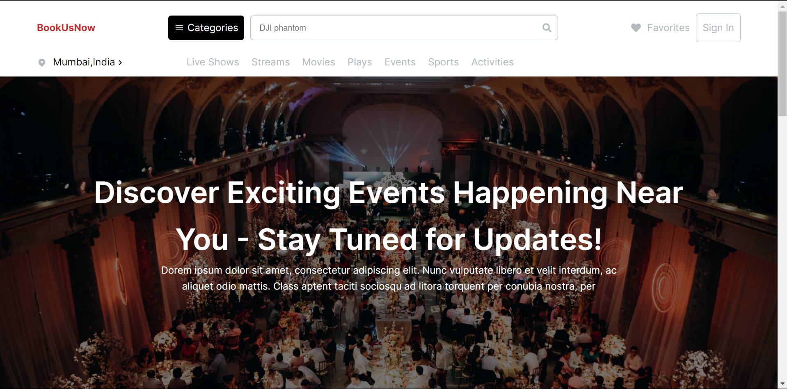

# BookUsNow

The Event Showcase Website is a platform designed to display upcoming and recommended events in a visually appealing manner. Leveraging REST APIs, the website fetches event data and presents it in an organized format. Key features include horizontal scrolling for recommended events, lazy loading for upcoming events, responsive design for both desktop and mobile browsers, and adherence to specified font and color schemes.



## Setup and Local Run Instructions

To set up and run the project locally, follow these steps:

1. Clone the Repository
   Clone the repository to your local machine using Git. Open your terminal or command prompt and execute the following command:

   ```
   git clone https://github.com/DurgaPrasad-R/GyanGrove.git
   ```

2. Install Dependencies
   Before running the project, you need to install its dependencies. Use npm to install dependencies.

   ```
   npm install
   ```

3. Start the Development Server
   Once the dependencies are installed, you can start the development server. This will compile the project and launch it in your default web browser. Run one of the following commands:

   ```
   npm start
   ```

4. Access the Website Locally
   After starting the development server, you can access the website locally by opening a web browser and navigating to the following URL:

   ```
   http://localhost:3000
   ```

The website should now be running locally on your machine, allowing you to explore its features and functionalities.

## Folder Structure

- node_modules
- public
- src
  - assets
  - components
    App.js
    ...
- package-lock.json
- package.json
- README.md

### Components
